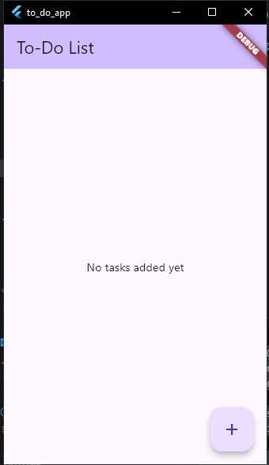
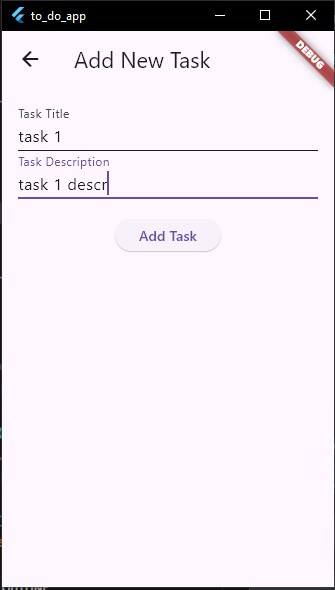
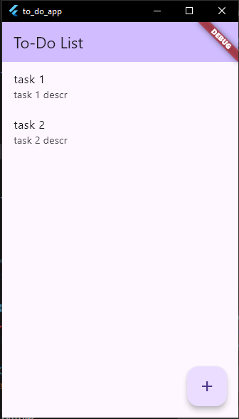

# Flutter ToDo App

A simple and clean To-Do application built with Flutter. This app allows users to add, view, and manage their daily tasks efficiently.

## Features

- Add new tasks with a title and description
- View a list of all tasks
- Simple and intuitive UI using Flutter's Material Design
- State management with Provider

## Screenshots





## Getting Started

To run this project locally:

1. **Clone the repository:**
   ```bash
   git clone https://github.com/mina-hill/Flutter-ToDo-App.git
   cd Flutter-ToDo-App
   ```

2. **Install dependencies:**
   ```bash
   flutter pub get
   ```

3. **Run the app:**
   ```bash
   flutter run
   ```

## Project Structure

- `lib/main.dart` - Application entry point
- `lib/models/` - Data models (e.g., `Task`)
- `lib/viewmodels/` - State management with Provider (`TaskViewModel`)
- `lib/views/` - UI screens (`TaskListScreen`, `AddTaskScreen`)

## Dependencies

- [provider](https://pub.dev/packages/provider): For state management

You can find all dependencies in the `pubspec.yaml` file.

## Contributing

Contributions are welcome! If you have suggestions or find a bug, please open an issue or submit a pull request.

1. Fork the repository
2. Create your feature branch (`git checkout -b feature/YourFeature`)
3. Commit your changes (`git commit -m 'Add some feature'`)
4. Push to the branch (`git push origin feature/YourFeature`)
5. Open a pull request

## License

This project is licensed under the MIT License.

---

*Built with Flutter ❤*
