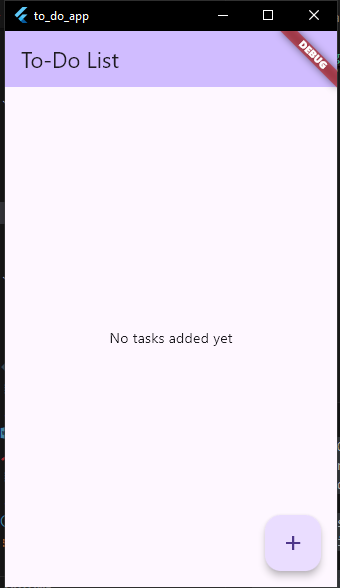
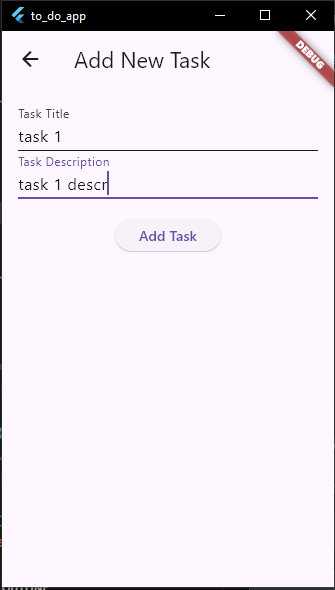
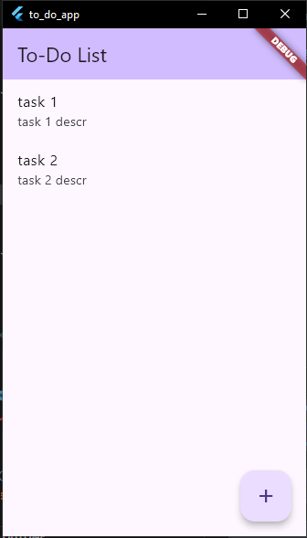
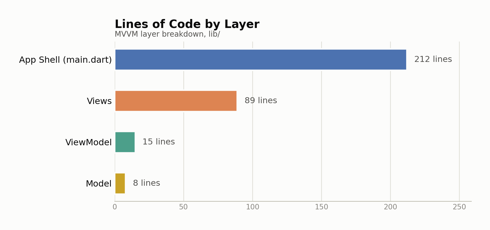
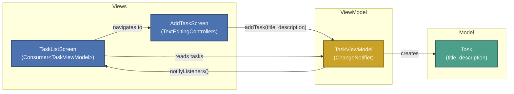

# Flutter To-Do App

**A clean, MVVM-structured To-Do list app for Flutter, powered by `provider`.**

Add tasks, view them in a live-updating list, and see the whole thing rebuild reactively the moment state changes — no manual `setState` plumbing required.


---

## Screenshots





The empty task list, the add-task form, and a populated list after two tasks have been added — all sharing the same soft lavender Material theme (`ThemeData(primarySwatch: Colors.brown)` tinted through `ColorScheme`) and a single floating action button for adding new tasks.

## Project at a Glance

The whole app is intentionally small: four `lib/` files plus the entry point, split cleanly across MVVM layers.

<picture>
  <source media="(prefers-color-scheme: dark)" srcset="docs/charts/loc-by-layer-dark.png">
  
</picture>

## Architecture — MVVM Data Flow

State flows one way down (View → ViewModel → Model) and one way back up via `ChangeNotifier.notifyListeners()`, which `Consumer<TaskViewModel>` picks up to rebuild only the widgets that need it.


```mermaid
flowchart LR
    subgraph Views
        TLS["TaskListScreen<br/>(Consumer&lt;TaskViewModel&gt;)"]
        ATS["AddTaskScreen<br/>(TextEditingControllers)"]
    end

    subgraph ViewModel
        TVM["TaskViewModel<br/>(ChangeNotifier)"]
    end

    subgraph Model
        TASK["Task<br/>(title, description)"]
    end

    ATS -- "addTask(title, description)" --> TVM
    TVM -- "creates" --> TASK
    TVM -- "notifyListeners()" --> TLS
    TLS -- "reads tasks" --> TVM
    TLS -- "navigates to" --> ATS

    classDef view fill:#4C72B0,stroke:#2E4670,stroke-width:2px,color:#ffffff
    classDef viewmodel fill:#C9A227,stroke:#7A6418,stroke-width:2px,color:#ffffff
    classDef model fill:#4C9F8A,stroke:#2F6455,stroke-width:2px,color:#ffffff

    class TLS,ATS view
    class TVM viewmodel
    class TASK model
```

## Features

| Feature | Description |
|---|---|
| Add tasks | `AddTaskScreen` collects a title and description via `TextEditingController`s and validates both are non-empty before submitting |
| View tasks | `TaskListScreen` renders all tasks in a `ListView.builder`, or a friendly "No tasks added yet" empty state |
| Reactive state management | `TaskViewModel` extends `ChangeNotifier`; adding a task calls `notifyListeners()` so the UI rebuilds automatically via `provider`'s `Consumer` |
| Input validation | Empty title/description is rejected client-side, with a `SnackBar` prompting the user to fill in all fields |
| MVVM separation | Models, view models, and views live in dedicated folders, keeping UI code free of business logic |

## Tech Stack

| Layer | Technology |
|---|---|
| Framework | Flutter (SDK `^3.6.1`) |
| Language | Dart |
| State Management | [provider](https://pub.dev/packages/provider) `^6.1.2` |
| Architecture | MVVM (Model–View–ViewModel) |
| Icons | Material Icons / `cupertino_icons` |
| Linting | `flutter_lints` `^5.0.0` |

## Getting Started

To run this project locally:

1. **Clone the repository:**
   ```bash
   git clone https://github.com/mina-hill/Flutter-ToDo-App.git
   cd Flutter-ToDo-App
   ```

2. **Install dependencies:**
   ```bash
   flutter pub get
   ```

3. **Run the app:**
   ```bash
   flutter run
   ```

## Project Structure

```
lib/
├── main.dart                       # App entry point, theme, and Provider setup
├── models/
│   └── task.dart                   # Task model (title, description)
├── viewmodels/
│   └── task_viewmodel.dart         # TaskViewModel — ChangeNotifier holding task list
└── views/
    ├── task_list_screen.dart       # Displays all tasks via Consumer<TaskViewModel>
    └── add_task_screen.dart        # Form for creating a new task
```

## Dependencies

- [provider](https://pub.dev/packages/provider): For state management

You can find all dependencies in the `pubspec.yaml` file.

## Contributing

Contributions are welcome! If you have suggestions or find a bug, please open an issue or submit a pull request.

1. Fork the repository
2. Create your feature branch (`git checkout -b feature/YourFeature`)
3. Commit your changes (`git commit -m 'Add some feature'`)
4. Push to the branch (`git push origin feature/YourFeature`)
5. Open a pull request

## License

This project is licensed under the MIT License.

---

*Built with Flutter ❤*
