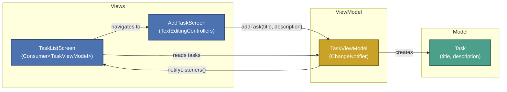

# Flutter To-Do App

**A clean, MVVM-structured To-Do list app for Flutter, powered by `provider`.**

Add tasks, view them in a live-updating list, and see the whole thing rebuild reactively the moment state changes — no manual `setState` plumbing required.


---

## Screenshots


The empty task list, the add-task form, and a populated list after two tasks have been added — all sharing the same soft lavender Material theme (`ThemeData(primarySwatch: Colors.brown)` tinted through `ColorScheme`) and a single floating action button for adding new tasks.

## Project at a Glance

The whole app is intentionally small: four `lib/` files plus the entry point, split cleanly across MVVM layers.

<picture>
  <source media="(prefers-color-scheme: dark)" srcset="docs/charts/loc-by-layer-dark.png">
  
</picture>

## Architecture — MVVM Data Flow

State flows one way down (View → ViewModel → Model) and one way back up via `ChangeNotifier.notifyListeners()`, which `Consumer<TaskViewModel>` picks up to rebuild only the widgets that need it.


```mermaid
flowchart LR
    subgraph Views
        TLS["TaskListScreen<br/>(Consumer&lt;TaskViewModel&gt;)"]
        ATS["AddTaskScreen<br/>(TextEditingControllers)"]
    end

    subgraph ViewModel
        TVM["TaskViewModel<br/>(ChangeNotifier)"]
    end

    subgraph Model
        TASK["Task<br/>(title, description)"]
    end

    ATS -- "addTask(title, description)" --> TVM
    TVM -- "creates" --> TASK
    TVM -- "notifyListeners()" --> TLS
    TLS -- "reads tasks" --> TVM
    TLS -- "navigates to" --> ATS

    classDef view fill:#4C72B0,stroke:#2E4670,stroke-width:2px,color:#ffffff
    classDef viewmodel fill:#C9A227,stroke:#7A6418,stroke-width:2px,color:#ffffff
    classDef model fill:#4C9F8A,stroke:#2F6455,stroke-width:2px,color:#ffffff

    class TLS,ATS view
    class TVM viewmodel
    class TASK model
```

## Features

| Feature | Description |
|---|---|
| Add tasks | `AddTaskScreen` collects a title and description via `TextEditingController`s and validates both are non-empty before submitting |
| View tasks | `TaskListScreen` renders all tasks in a `ListView.builder`, or a friendly "No tasks added yet" empty state |
| Reactive state management | `TaskViewModel` extends `ChangeNotifier`; adding a task calls `notifyListeners()` so the UI rebuilds automatically via `provider`'s `Consumer` |
| Input validation | Empty title/description is rejected client-side, with a `SnackBar` prompting the user to fill in all fields |
| MVVM separation | Models, view models, and views live in dedicated folders, keeping UI code free of business logic |

## Tech Stack

| Layer | Technology |
|---|---|
| Framework | Flutter (SDK `^3.6.1`) |
| Language | Dart |
| State Management | [provider](https://pub.dev/packages/provider) `^6.1.2` |
| Architecture | MVVM (Model–View–ViewModel) |
| Icons | Material Icons / `cupertino_icons` |
| Linting | `flutter_lints` `^5.0.0` |

## Getting Started

To run this project locally:

1. **Clone the repository:**
   ```bash
   git clone https://github.com/mina-hill/Flutter-ToDo-App.git
   cd Flutter-ToDo-App
   ```

2. **Install dependencies:**
   ```bash
   flutter pub get
   ```

3. **Run the app:**
   ```bash
   flutter run
   ```

## Project Structure

```
lib/
├── main.dart                       # App entry point, theme, and Provider setup
├── models/
│   └── task.dart                   # Task model (title, description)
├── viewmodels/
│   └── task_viewmodel.dart         # TaskViewModel — ChangeNotifier holding task list
└── views/
    ├── task_list_screen.dart       # Displays all tasks via Consumer<TaskViewModel>
    └── add_task_screen.dart        # Form for creating a new task
```

## Dependencies

- [provider](https://pub.dev/packages/provider): For state management

You can find all dependencies in the `pubspec.yaml` file.

## Design Decisions

**Why `provider` + `ChangeNotifier` instead of Bloc, Riverpod, or GetX?**
For an app with exactly one piece of shared state — a `List<Task>` — reaching for Bloc's stream/event/state boilerplate or Riverpod's provider-graph machinery would add ceremony without adding value. `Bloc` shines when you need explicit event-sourcing and time-travel debugging across many interacting streams; `Riverpod` earns its keep when you need compile-time-safe DI across a large provider graph; `GetX` trades explicitness for terseness (service locator + reactive `.obs` fields) in a way that tends to hide dependencies as an app grows. `provider` on top of Dart's own `ChangeNotifier` is the smallest step up from `setState`: one mutable model, one `notifyListeners()` call, one `Consumer` that rebuilds. It's also what the Flutter team recommends in the official state-management docs for small-to-medium apps, which matches this project's actual size (four `lib/` files).

**Why MVVM here specifically?**
The repo is small enough that a single `StatefulWidget` per screen would "work," but MVVM was chosen so the split stays obvious as the app grows past a to-do list: `Task` (Model) only ever describes data shape, `TaskViewModel` (ViewModel) is the *only* place task-list state is mutated, and `TaskListScreen`/`AddTaskScreen` (Views) never touch `_tasks` directly — they call `context.read`/`Provider.of` on the ViewModel and rebuild via `Consumer`. That means a future swap to, say, a REST-backed `TaskViewModel` would touch exactly one file and zero widgets.

**Theme application.** `MyApp` sets a single `ThemeData(primarySwatch: Colors.brown)` in `main.dart`. Neither `TaskListScreen` nor `AddTaskScreen` defines its own colors — the `AppBar`'s `backgroundColor: Theme.of(context).colorScheme.inversePrimary` is *derived* from that one swatch by Flutter's Material color-scheme generation, which is why the screenshots read as a soft, muted palette rather than literal brown: `inversePrimary` is the light, low-saturation tone Material computes to contrast against the primary. There is no `ThemeData.dark()`, no `ColorScheme.fromSeed`, and no runtime theme toggle — light mode only, by omission rather than by an explicit decision recorded in code.

**Empty-state handling.** `TaskListScreen`'s `Consumer<TaskViewModel>` builder is a plain ternary: `tasks.isEmpty ? Center(child: Text('No tasks added yet')) : ListView.builder(...)`. There's no separate "empty state" widget, illustration, or call-to-action beyond the FAB that's always present in the `Scaffold` — the simplest possible branch that still avoids handing `ListView.builder` an `itemCount` of 0 with awkward blank space.

**Validation.** Validation is intentionally shallow and happens in *two* places: `AddTaskScreen`'s button `onPressed` trims both controllers' text and checks `isNotEmpty` before calling `addTask`, showing a `SnackBar` ("Please fill in all fields") on the empty-field path instead of navigating away; `TaskViewModel.addTask()` then repeats the identical `isNotEmpty` check before mutating `_tasks`. That second check is a defensive guard against any future caller that skips the View's own validation (e.g. a test, or another screen calling `addTask` directly) — not a different validation rule, just the same rule enforced twice, once at the UI boundary and once at the model boundary.

## Code Walkthrough

Tracing one full add-task cycle, by real class and method name:

1. **Tap the FAB.** `TaskListScreen.build()` wires the `FloatingActionButton`'s `onPressed` to `Navigator.push(context, MaterialPageRoute(builder: (context) => AddTaskScreen()))` — a plain, non-animated route push to a fresh `AddTaskScreen` instance.
2. **`AddTaskScreen` collects input.** Its two `final TextEditingController` fields (`_titleController`, `_descriptionController`) back two `TextField`s. Nothing in the ViewModel or Model is touched yet; this screen only holds transient text-entry state.
3. **Tap "Add Task."** The `ElevatedButton`'s `onPressed` reads `_titleController.text.trim()` and `_descriptionController.text.trim()` into locals, then branches on `title.isNotEmpty && description.isNotEmpty`.
4. **Happy path → the ViewModel.** `Provider.of<TaskViewModel>(context, listen: false).addTask(title, description)` is called. `listen: false` matters here: `AddTaskScreen` is a `StatelessWidget` that only ever *writes* to the ViewModel, so it deliberately opts out of subscribing to rebuilds it doesn't need.
5. **`TaskViewModel.addTask()` mutates state.** Inside, the same non-empty check re-runs, then `_tasks.add(Task(title: title, description: description))` appends to the private `List<Task> _tasks`, and `notifyListeners()` (inherited from `ChangeNotifier`) fires synchronously — every listener registered on this `TaskViewModel` instance is notified before `addTask()` returns.
6. **Back to the list.** Immediately after the `addTask()` call returns, `Navigator.pop(context)` closes `AddTaskScreen` and returns control to `TaskListScreen`.
7. **`Consumer<TaskViewModel>` rebuilds.** The single `ChangeNotifierProvider(create: (_) => TaskViewModel())` registered in `main.dart`'s `MultiProvider` owns the one `TaskViewModel` instance for the whole app's widget tree. Because `TaskListScreen.build()` wraps its body in `Consumer<TaskViewModel>`, that `notifyListeners()` call from step 5 schedules exactly that `builder` callback to re-run — not the whole `TaskListScreen`, just the `Consumer`'s subtree.
8. **New list renders.** The builder re-reads `taskViewModel.tasks` (a direct reference to the same growing `_tasks` list, not a copy), sees `tasks.isEmpty` is now `false`, and `ListView.builder` is rebuilt with the new `itemCount` and an extra `ListTile` for the just-added task.
9. **Unhappy path.** If either field was empty, `addTask()` is never called, `Navigator.pop` never runs, and `ScaffoldMessenger.of(context).showSnackBar(...)` shows the "Please fill in all fields" message — the user stays on `AddTaskScreen` with their partial input intact.

## Known Limitations & Future Improvements

Verified directly against the current code in `lib/`, not aspirational — each item below is something the app genuinely does not do yet:

- **No persistence.** `pubspec.yaml` pulls in no storage package (no `shared_preferences`, `sqflite`, `hive`, etc.), and `TaskViewModel._tasks` is a plain in-memory `List<Task>` field. Every task is lost on hot restart or app close; there is no read/write path to disk at all.
- **No task deletion.** `TaskViewModel` exposes only `addTask()` — there's no `removeTask`/`deleteTask`, and `TaskListScreen`'s `ListTile`s have no delete icon, swipe-to-dismiss, or long-press menu.
- **No task editing.** Same gap as above: no `updateTask()` on the ViewModel, and tapping a `ListTile` in `TaskListScreen` does nothing (no `onTap` is even wired).
- **No "mark as complete" toggle.** The `Task` model (`lib/models/task.dart`) has exactly two fields — `title` and `description` — no `bool isDone`/`completed`, so there's nothing for a checkbox to bind to.
- **No due dates, priorities, or categories.** Again a `Task` model gap: no `DateTime`, no priority enum, no tag/category string. Every task is just a title and a description with no metadata.
- **No unique task IDs.** `Task` has no `id` field, which is also *why* deleting or editing a single task isn't a small addition — two tasks with identical title/description are presently indistinguishable to the ViewModel.
- **No sorting, filtering, or search.** `TaskListScreen` always renders `tasks` in raw insertion order via `ListView.builder`; there's no search field, filter chip, or sort control anywhere in the Views.
- **Stale test suite.** `test/widget_test.dart` is still the unmodified default `flutter create` counter-app smoke test (it asserts `find.text('0')`/`find.text('1')` and taps an increment button) — it doesn't exercise `TaskViewModel`, `TaskListScreen`, or `AddTaskScreen` at all, and would fail if actually run against this app.
- **Undisposed `TextEditingController`s.** `AddTaskScreen` is a `StatelessWidget` holding `TextEditingController` fields directly; stateless widgets have no `dispose()` lifecycle hook, so those controllers are never explicitly disposed — a minor resource leak that's inconsequential at this scale but would need fixing (likely by converting to a `StatefulWidget`) before the pattern is reused elsewhere.
- **Single light theme only.** Only one `ThemeData(primarySwatch: Colors.brown)` is defined; there's no `ThemeData.dark()`, no `ThemeMode` toggle, and no persistence of a theme preference even if one were added.

**Suggested next steps, roughly in order of value-per-effort:** add an `id` (e.g. `UUID` or simple incrementing int) and a `bool isDone` to `Task`; add `toggleTask(id)` and `removeTask(id)` to `TaskViewModel`; wrap the list in `shared_preferences` (simplest) or `sqflite`/`hive` (more scalable) so tasks survive restarts; replace `test/widget_test.dart` with real tests around `TaskViewModel.addTask()`/`notifyListeners()` behavior; and only reach for `Bloc`/`Riverpod` if/when the state graph actually grows past "one list, one screen that edits it."

## Contributing

Contributions are welcome! If you have suggestions or find a bug, please open an issue or submit a pull request.

1. Fork the repository
2. Create your feature branch (`git checkout -b feature/YourFeature`)
3. Commit your changes (`git commit -m 'Add some feature'`)
4. Push to the branch (`git push origin feature/YourFeature`)
5. Open a pull request

## License

This project is licensed under the MIT License.

---

*Built with Flutter ❤*
